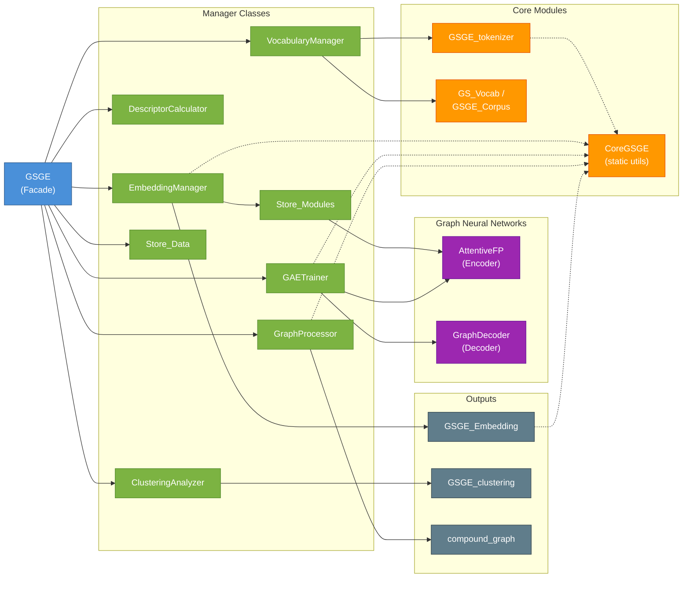
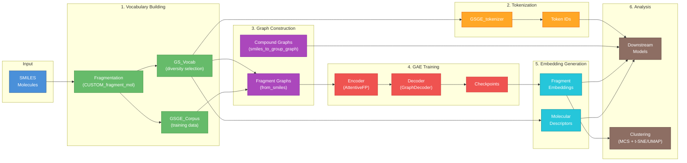
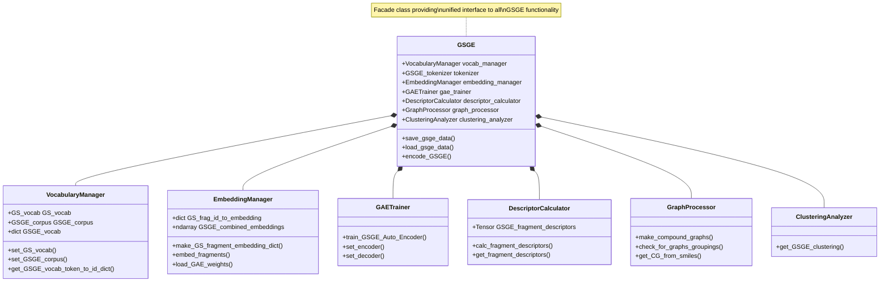
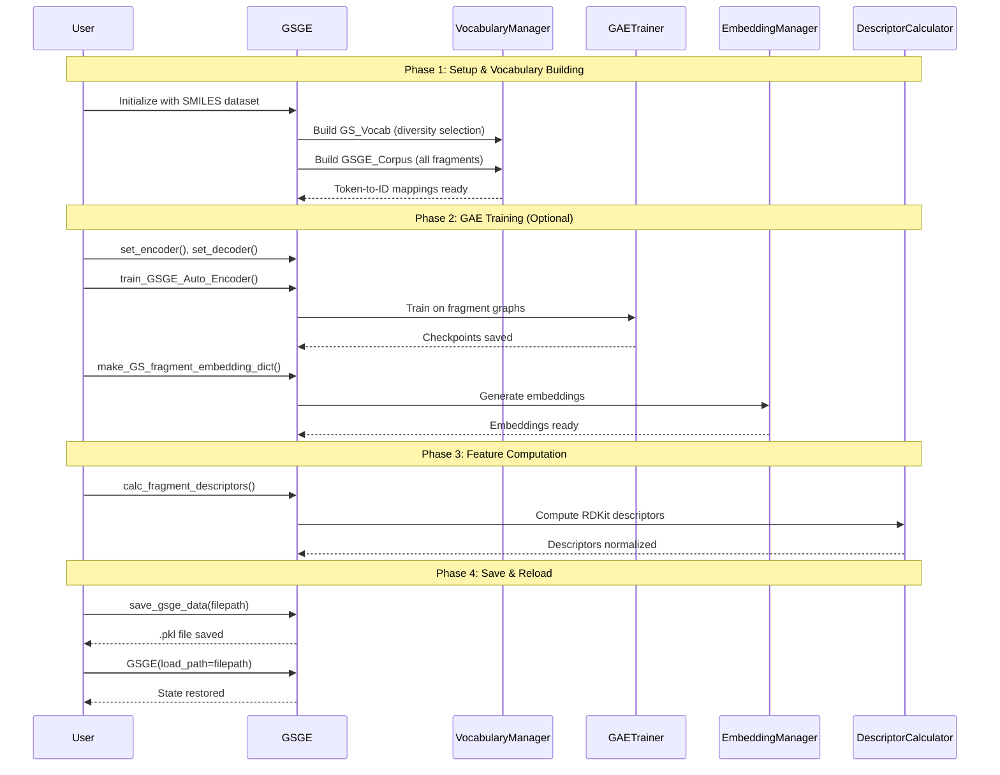

## Architecture

GSGE follows a **Facade pattern** with the main `GSGE` class (in `GSGE/gsge.py`) delegating functionality to specialized manager classes. The codebase is organized into functional modules:

### Architecture Overview

### Data Flow Pipeline

### Module Hierarchy

### Typical Usage Workflow

### Core Modules

**`GSGE/gsge.py`** - Main facade class and managers
- `GSGE`: Primary interface for the entire framework
- `VocabularyManager`: Manages GS_Vocab and GSGE_Corpus loading and token-to-ID mappings
- `EmbeddingManager`: Handles GAE embedding generation and loading for fragments
- `GAETrainer`: Wraps GraphAutoencoderTrainer for training fragment autoencoders
- `DescriptorCalculator`: Computes RDKit molecular descriptors for fragments
- `GraphProcessor`: Converts SMILES to PyTorch Geometric graph representations
- `ClusteringAnalyzer`: Performs clustering using embeddings and Maximum Common Substructure (MCS)
- `Store_Data`: Handles pickle-based save/load of complete GSGE state
- `Store_Modules`: Storage container for PyTorch encoder/decoder modules

**`GSGE/vocab.py`** - Vocabulary and corpus management
- `BaseGSVocab`: Abstract base class with fragment canonicalization and persistence
- `GS_Vocab`: Vocabulary builder with diversity selection and core merging (for generalization)
- `GSGE_Corpus`: Corpus builder allowing non-unique fragments (for GAE training data)

**`GSGE/core_gsge.py`** - Core preprocessing functions
- Token-to-ID preprocessing functions
- Static methods for preparing GAE training data
- Parallel tokenization utilities

**`GSGE/tokenizer.py`** - Tokenization logic
- `GSGE_tokenizer`: Converts molecules/SMILES to GSGE token sequences

**`GSGE/chem.py`** - Chemical constants and utilities
- Grammar tokens, element tokens, special tokens
- Common smaller fragments (amide, peptide bond patterns)
- Element bond counts

**`GSGE/fragment_functions.py`** - Custom fragmentation
- `CUSTOM_fragment_mol`: Fragmentation function for cyclic peptides (removes ring bonds, amide bonds, disulfide bonds)

**`GSGE/fragment_tools.py`** - Fragment SMILES utilities
- `FragmentTools`: Base class for fragment canonicalization and SMILES handling
- `GS_FragmentTools`: Extended utilities including `make_element_GS` for creating element fragments

**`GSGE/fragment_descriptors.py`** - Molecular descriptor calculation
- `get_mol_frag_descriptors`: Computes RDKit descriptors for fragments
- `normalize_descriptors`: Normalizes descriptors using training data statistics

**`GSGE/clustering.py`** - Clustering analysis
- `GSGE_clustering`: Clusters fragments using UMAP/t-SNE visualization and hierarchical clustering with MCS

**`GSGE/embedding.py`** - Embedding layer for downstream models
- `GSGE_Embedding`: Combines sparse one-hot encodings (grammar/element tokens) with dense GAE embeddings (fragment tokens)

**`GSGE/plots.py`** - Fragment visualization
- `highlight_fragments`: Highlights molecular fragments in compound visualizations
- Color generation utilities for fragment highlighting

**`GSGE/visualization.py`** - Additional visualization utilities
- `plot_cluster_grid`: Grid visualization of molecules from each cluster
- Static matplotlib-based plots complementing interactive Plotly methods

**`GSGE/utils_chem.py`** - Chemical utilities
- Data validation and NaN checking functions
- Utility functions for chemical data processing

### Graph Modules

**`GSGE/graphs/fragment_graph/GAE.py`** - Graph Autoencoder
- `AttentiveFP`: Attentive Graph Neural Network encoder
- `GraphDecoder`: Decoder for reconstructing molecular graphs
- `GraphAutoencoderTrainer`: Training loop with checkpointing
- `ATOM_MAX_NUM`: Maximum atoms per fragment (default 20)

**`GSGE/graphs/fragment_graph/from_smiles_to_graph.py`**
- `from_smiles`: Converts fragment SMILES to PyTorch Geometric Data object
- `atom_to_token_id`: Mapping from atom types to token IDs

**`GSGE/graphs/fragment_graph/utils_chem.py`** - Chemical utilities for graphs
- Fragment-level chemical property computation

**`GSGE/graphs/fragment_graph/parsed_log_metric_plots.py`** - Training log utilities
- `parse_log_file`: Parses GAE training logs for metric extraction and plotting

**`GSGE/graphs/compound_graph/data.py`** - Compound graph creation
- `compound_graph`: Group-level molecular graph class extending MolecularGraph
- `smiles_to_group_graph`: Converts SMILES to compound graph (fragment nodes)
- `parallel_`: Parallel processing for batch compound graph generation
- `preprocess_graph`: Preprocessing for graph neural networks

### Scripts

**`GSGE/scripts/CLI.py`** - Command-line interface
- `GSGE_CLI run_test`: Run all or specific tests
- Tests are located in `tests/` directory at project root

### Package Exports

**`GSGE/__init__.py`** - Public API
- Main classes: `GSGE`, `GS_Vocab`, `GSGE_Corpus`, `GSGE_tokenizer`, `GSGE_Embedding`
- Utilities: `FragmentTools`, `GS_FragmentTools`, `CoreGSGE`, `highlight_fragments`
- Constants: `_GRAMMAR_TOKENS`, `_ELEMENT_TOKENS`, `_REDIRECT_TOKENS`, `_ELEMENTS_BOND_COUNTS`
- Path utilities: `get_package_resource()`, `get_project_root()`, `get_tests_dir()`, `get_use_examples_dir()`

