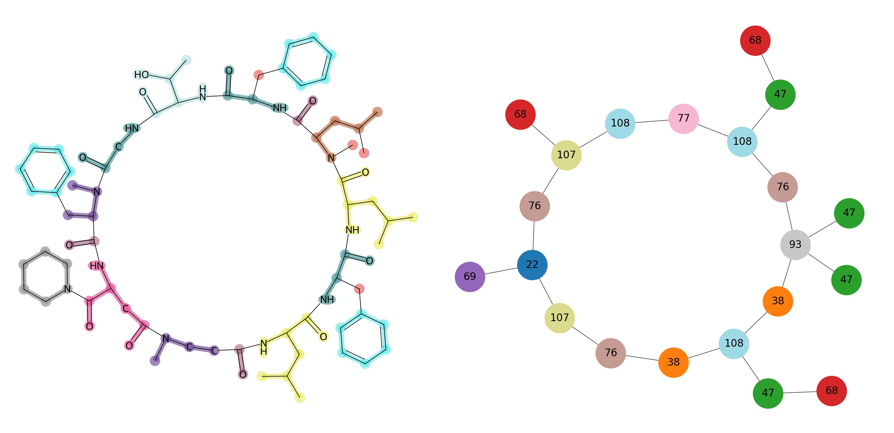
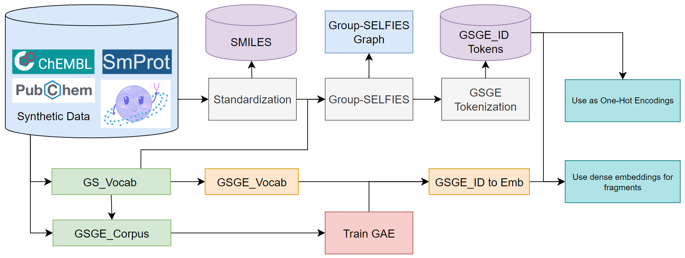
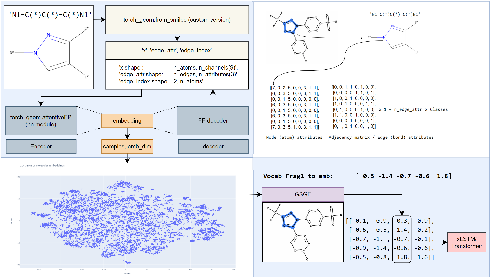

# Group-SELFIES Graph Embeddings (GSGE) 🚀

[](https://github.com/CDDLeiden/GSGE/actions?query=workflow%3ATests)
[](https://codecov.io/gh/CDDLeiden/GSGE)
[](https://www.python.org/downloads/)
[](https://opensource.org/licenses/MIT)
[](https://CDDLeiden.github.io/gsge/)
[](https://github.com/psf/black)
[](https://pypi.org/project/gsge/)

GSGE is a Python package for functional group aware molecular fragment tokenization and fragment-level graph embeddings. It combines group-SELFIES-based fragmentation with graph autoencoders so molecules can be represented as graphs whose nodes are chemically meaningful fragments rather than individual atoms.

GSGE supports:
- Building fragment vocabularies for a specific chemical space
- Tokenizing molecules into Group-SELFIES-like fragment sequences
- Creating compound graphs with fragment nodes
- Training fragment graph autoencoders and reusing the learned embeddings
- Combining learned embeddings with fragment descriptors for downstream models

---


Figure 1. Example compound graph built from fragment nodes.

## Installation

### Install from PyPI

```bash
pip install GSGE
```

### Install from source

```bash
git clone https://github.com/CDDLeiden/GSGE
cd GSGE
pip install .
```

Optional extras from a source checkout:

```bash
pip install ".[viz]"
pip install ".[notebooks]"
pip install ".[viz,notebooks]"
```

### GPU support

`pip install GSGE` or `pip install .` will install PyTorch from the default index. If you want a CUDA build, install PyTorch first and then install GSGE:

```bash
pip install torch --index-url https://download.pytorch.org/whl/cu128
pip install GSGE
```

See `docs/getting-started/installation.md` for more installation options and troubleshooting.

### Developer setup

```bash
git clone https://github.com/CDDLeiden/GSGE
cd GSGE
bash install.sh
```

This creates a `gsge-dev` conda environment and installs GSGE in editable mode with the development extras.

### Verify installation

```bash
python -c "import GSGE; from GSGE import GS_Vocab, GSGE_Corpus; print('Installation successful')"
GSGE_CLI run_test --help
```

Notes:
- Python `>=3.10` is supported
- `numpy<=2.3.0` is required by the current package metadata
- The `group-selfies` dependency is installed from `https://github.com/JasperDurinck/group-selfies`, so `git` must be available during install

## Quick start


Figure 2. Typical GSGE workflow.

### 1. Build a vocabulary and corpus

Use `GS_Vocab` for the merged fragment vocabulary used in representation learning, and `GSGE_Corpus` for the non-merged fragment set used to train the graph autoencoder.

```python
from GSGE import GS_Vocab, GSGE_Corpus, GSGE, CUSTOM_fragment_mol

smiles_list = [
    "CCO",
    "CC(=O)NC",
    "c1ccccc1O",
]

corpus = GSGE_Corpus()
corpus.build_corpus(
    smiles_list,
    min_size=1,
    max_size=15,
    fragment_mol_fn=CUSTOM_fragment_mol,
    convert=True,
    fragmented=False,
)
corpus.save_GSGE_corpus(vocab_name="GSGE_corpus_example")

vocab = GS_Vocab()
vocab.build_vocab(
    m_set=smiles_list,
    convert=True,
    n_limit=1,
    target=200,
    MIN_SIZE=1,
    MAX_SIZE=15,
    fragment_mol_fn=CUSTOM_fragment_mol,
)
vocab.add_GS_fragment("O=C(*1)(*1)")
vocab.add_GS_fragment("N=C(*1)(*1)")
vocab.save_GS_vocab(vocab_name="GS_vocab_example")

gsge = GSGE(GS_vocab=vocab, GSGE_corpus=corpus)
gsge.add_all_single_elements()
gsge.add_GS_vocab_to_GSGE_corpus()
```

Why both objects matter:
- `GS_Vocab` stores merged, generalized fragments for representing molecules
- `GSGE_Corpus` keeps non-merged fragments, which is useful for fragment GAE training and data augmentation

### 2. Tokenize molecules and build compound graphs

```python
from GSGE import GSGE

gsge = GSGE(GS_vocab="GS_vocab_example")
gsge.add_all_single_elements()

tokens = gsge.preprocess_from_SMILES("CCO")
compound_graphs = gsge.make_compound_graphs(["CCO", "CC(=O)NC"], pyg_data=False)

cg = gsge.get_CG_from_smiles("CCO", return_CG_object=True)
cg.plot_graph_rd_c_style()
```

### 3. Train the fragment graph autoencoder

The easiest route is the high-level `GSGE` wrapper:

```python
from GSGE import GSGE

gsge = GSGE(GS_vocab="GS_vocab_example", GSGE_corpus="GSGE_corpus_example")
gsge.train_GSGE_Auto_Encoder(
    batch_size=64,
    num_epochs=300,
    checkpoint_interval=5,
    checkpoint_dir="model_checkpoints",
)
```

If you want lower-level control, the core training API lives in `GSGE.graphs.fragment_graph.GAE` and `GSGE.core_gsge.CoreGSGE`.

### 4. Generate and use fragment embeddings

```python
from GSGE import GSGE, GSGE_Embedding

gsge = GSGE(GS_vocab="GS_vocab_example")
gsge.set_encoder()
gsge.load_GAE_weights("model_checkpoints/checkpoint_epoch_300.pth", map_location="cpu")
gsge.make_GS_fragment_embedding_dict()

lookup_table = gsge.get_fragment_embeddings()
token_vocab = gsge.get_GSGE_vocab()

embedding_layer = GSGE_Embedding(
    sparse_vocab_size=len(token_vocab),
    dense_size=lookup_table.shape[1],
    embedding_dim=128,
    GSGE_combined_embeddings=lookup_table,
    only_token2vec=True,
    no_grad=True,
)
```

You can also combine learned fragment embeddings with RDKit fragment descriptors:

```python
gsge.calc_fragment_descriptors(
    descriptor_keys=["MolWt", "TPSA", "NumHDonors", "NumHAcceptors"]
)
combined = gsge.get_fragment_descriptors_and_embeddings()
```

## Tutorials and examples

Jupyter notebook tutorials live in `use_examples/`.

| Topic | Path |
| --- | --- |
| Vocabulary and corpus building | `use_examples/00_making_vocabs/vocabulary_and_corpus_tutorial.ipynb` |
| Compound graphs | `use_examples/01_make_compound_graphs/compound_graphs_tutorial.ipynb` |
| Tokenization | `use_examples/02_tokenization_example/tokenization_tutorial.ipynb` |
| GAE training and embedding visualization | `use_examples/03_GAE/` |
| Using embeddings | `use_examples/04_use_embeddings/embeddings_tutorial.ipynb` |
| Fragment descriptors | `use_examples/05_mol_frag_features/fragment_descriptors.ipynb` |
| End-to-end property prediction | `use_examples/06_end_to_end/property_prediction_tutorial.ipynb` |

Recommended learning path:
1. Start with `use_examples/00_making_vocabs/`
2. Continue with `use_examples/01_make_compound_graphs/`
3. Add `use_examples/03_GAE/` if you want learned fragment embeddings
4. Finish with the tutorial that matches your downstream use case

### Pretrained example assets

The repository includes example `.pkl` files in `tests/` and `use_examples/` that are useful when working from a source checkout.

```python
from GSGE import GSGE, get_tests_dir

tests_dir = get_tests_dir()
if tests_dir is not None:
    gsge = GSGE(GSGE_load_path=tests_dir / "test_gsge_save_with_descriptors.pkl")
```

Note: `get_tests_dir()` returns `None` in a standard pip install because `tests/` is not part of the installed package.

## Visual example

The figure below shows an example fragment embedding projection from one of the included experiments.


Figure 3. Example 2D view of learned fragment embeddings.

## Testing

From a source checkout, you can run tests either through `pytest` or through the CLI helper.

```bash
pytest
pytest tests/test_make_gsge_vocab.py

GSGE_CLI run_test
GSGE_CLI run_test --file test_make_cg.py
```

Note: `GSGE_CLI run_test` relies on the repository `tests/` directory, so it is mainly intended for editable installs or source checkouts.

## Requirements

Core runtime requirements are declared in `pyproject.toml` and currently include:
- Python `>=3.10`
- `rdkit==2024.9.6`
- `numpy<=2.3.0`
- `torch>=2.0.0`
- `torch_geometric>=2.3.0`
- `pandas`, `scipy`, `scikit-learn`, `joblib`, `pyarrow`, `selfies`
- `group-selfies` from the maintained GitHub fork

## Documentation and contributing

- Docs: https://CDDLeiden.github.io/gsge/
- Installation guide: `docs/getting-started/installation.md`
- Contributing guide: `CONTRIBUTING.md`
- Tutorials: `use_examples/`
