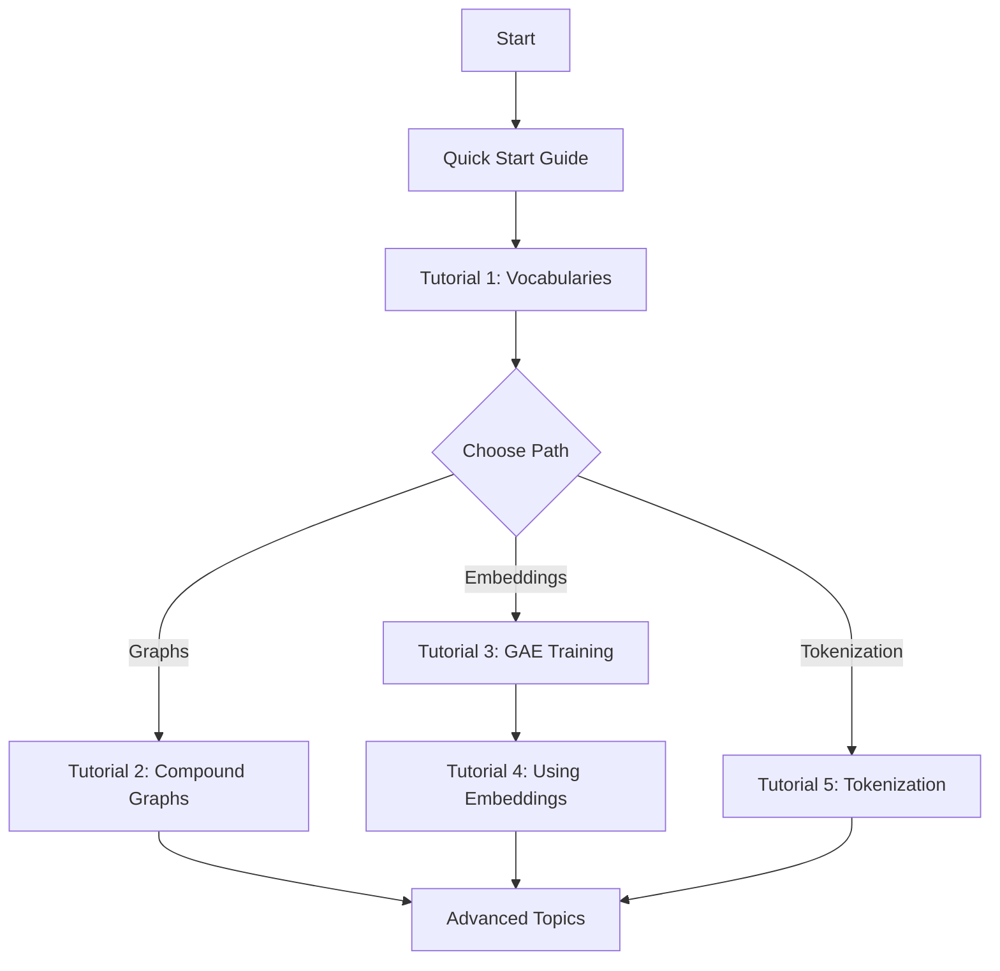

# Tutorials

Interactive Jupyter notebook tutorials demonstrating real-world GSGE usage.

## Available Tutorials

### 1. Building Vocabularies

Learn how to build custom molecular fragment vocabularies for different chemical spaces.

**Topics covered:**
- Building vocabularies from molecule datasets
- Customizing fragment extraction with bond-cutting rules
- Optimizing vocabulary size and fragment coverage
- Handling different molecular modalities (small molecules, peptides, macrocycles)
- Validating vocabulary coverage

**Notebook**: `use_examples/making_vocabs/make_GS_vocab_and_GSGE_corpus_v5.ipynb`

### 2. Creating Compound Graphs

Transform molecules into fragment-based graph representations.

**Topics covered:**
- Converting SMILES to compound graphs
- Understanding graph structure (nodes as fragments, edges as bonds)
- Visualizing compound graphs
- Batch processing for large datasets
- PyTorch Geometric integration

**Notebook**: `use_examples/make_compound_graphs/example.ipynb`

### 3. Training the Graph Autoencoder

Train neural networks to learn continuous fragment embeddings.

**Topics covered:**
- Preparing training data from corpus
- Configuring encoder (AttentiveFP) and decoder architectures
- Setting up training loop with checkpointing
- Monitoring training metrics
- Evaluating reconstruction quality
- Hyperparameter tuning

**Notebook**: `use_examples/GAE/training_example.ipynb`

### 4. Using Fragment Embeddings

Apply learned embeddings for downstream tasks.

**Topics covered:**
- Generating embeddings for vocabulary fragments
- Creating embedding lookup tables for PyTorch
- Integrating embeddings into molecular property prediction models
- Combining embeddings with RDKit descriptors
- Embedding quality analysis

**Notebook**: `use_examples/use_embeddings/embedding_usage.ipynb`

### 5. Tokenization Examples

Convert molecules to sequences of fragment tokens.

**Topics covered:**
- Single molecule tokenization
- Batch parallel tokenization
- Token-to-ID conversion
- Padding and masking strategies
- Integration with sequence models (RNNs, Transformers)
- Vocabulary-based tokenization schemes

**Notebook**: `use_examples/tokenization_example/tokenization_demo.ipynb`

## Tutorial Structure

Each tutorial follows this structure:

1. **Setup**: Import libraries and load data
2. **Concepts**: Explain the key concepts
3. **Implementation**: Step-by-step code with explanations
4. **Visualization**: Plots and visualizations
5. **Exercises**: Optional challenges to deepen understanding
6. **Next Steps**: Links to related tutorials

## Running the Tutorials

### Prerequisites

Ensure you have installed GSGE with notebook support:

```bash
pip install ".[notebooks]"
```

### Launch Jupyter

From the GSGE repository root:

```bash
cd use_examples
jupyter notebook
```

Navigate to the specific tutorial folder and open the `.ipynb` file.

### Google Colab

Many tutorials can be run in Google Colab for free GPU access. Look for the "Open in Colab" badge at the top of each notebook.

## Learning Path

We recommend following this path for learning GSGE:



## Datasets

Tutorials use several example datasets:

- **Small molecules**: ~1000 drug-like molecules from public databases
- **Linear peptides**: Peptide sequences with 5-15 amino acids
- **Cyclic peptides**: Complex macrocycles from research projects
- **Fragment libraries**: Pre-computed vocabularies for different domains

All datasets are included in the repository under `use_examples/data/`.

## Common Issues

### Kernel Dies During Training

**Solution**: Reduce batch size or use CPU for small examples

```python
# In notebook
trainer.train(
    num_epochs=10,  # Fewer epochs for demo
    batch_size=16   # Smaller batch size
)
```

### Missing Dependencies

**Solution**: Install optional packages

```bash
pip install plotly seaborn matplotlib ipykernel
```

### CUDA Out of Memory

**Solution**: Use CPU or reduce model size

```python
device = 'cpu'  # Instead of 'cuda'

# Or smaller model
encoder = AttentiveFP(
    in_channels=9,
    hidden_channels=128,  # Reduced from 256
    out_channels=64,      # Reduced from 128
    ...
)
```

## Contributing Tutorials

We welcome tutorial contributions! See our [Contributing Guide](../development/contributing.md) for:

- Tutorial format and structure
- Code style guidelines
- Notebook best practices
- Review process

### Tutorial Checklist

When creating a tutorial:

- [ ] Clear learning objectives stated upfront
- [ ] Code cells with explanatory markdown
- [ ] Visualization of results
- [ ] Error handling examples
- [ ] Links to API reference
- [ ] Estimated completion time noted
- [ ] Tested on clean environment

## Additional Resources

- **API Reference**: [Complete API documentation](../api-reference/index.md)
- **User Guide**: [Detailed guides for each component](../user-guide/index.md)
- **GitHub**: [Source code and issues](https://github.com/CDDLeiden/GSGE)

## Feedback

Found an issue with a tutorial? Have suggestions for improvements?

- [Open an issue on GitHub](https://github.com/CDDLeiden/GSGE/issues)
- [Start a discussion](https://github.com/CDDLeiden/GSGE/discussions)
