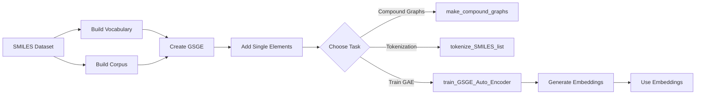

# User Guide

Welcome to the GSGE User Guide. This guide covers vocabulary and corpus management.

## [Vocabularies & Corpus](vocabularies.md)

Learn how to build and customize molecular fragment vocabularies and corpora:

- Building vocabularies from molecular datasets
- Customizing bond-cutting rules
- Managing fragment sizes and complexity
- Merging vs. non-merged fragments
- Saving and loading vocabularies

## Typical Workflow

A typical GSGE workflow follows these steps:

## Getting Started

If you're new to GSGE:

1. **Start with [Quick Start](../getting-started/quickstart.md)** - Get familiar with basic usage
2. **Read [Vocabularies](vocabularies.md)** - Understand the foundation of GSGE
3. **Explore [API Reference](../api-reference/index.md)** - See detailed API documentation

## Additional Resources

- [API Reference](../api-reference/index.md) - Detailed API documentation
- [Tutorials](../tutorials/index.md) - Interactive Jupyter notebooks
- [GitHub Repository](https://github.com/CDDLeiden/GSGE) - Source code and issues
