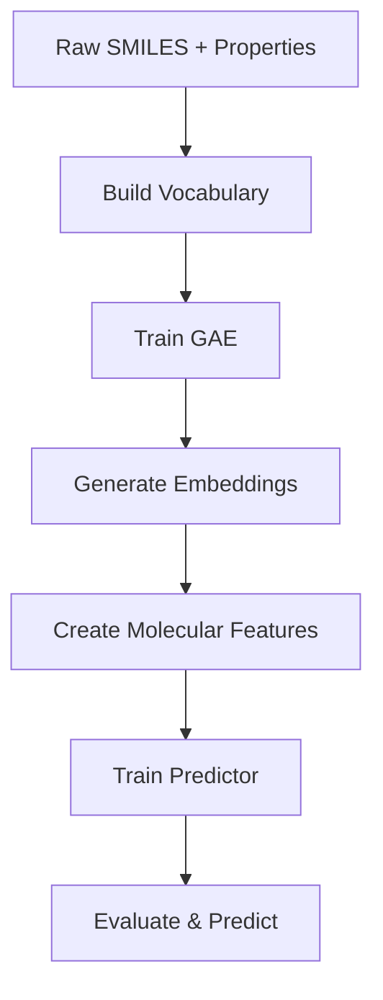

# End-to-End Property Prediction Tutorial

This tutorial demonstrates a complete machine learning pipeline using GSGE fragment embeddings for molecular property prediction.

> **Time Estimate Note**
> GPU acceleration significantly reduces training time:
> - **CPU:** 5-7 hours (GAE training dominates)
> - **GPU:** 2-3 hours (GAE training 3-4x faster)
>
> Consider using the pre-trained model if you don't have GPU access.

## Tutorials in This Module

| Tutorial | Time Category | Time Estimate | Difficulty | Description |
|----------|---------------|---------------|------------|-------------|
| property_prediction_tutorial.ipynb | Long | 5-7h CPU / 2-3h GPU | Intermediate | Complete ML pipeline |

## Prerequisites

- [x] GSGE installed (see [Installation Guide](../../Installation.md))
- [ ] Basic understanding of machine learning
- [ ] Dataset of molecules with target properties (500+ molecules recommended)
- [ ] Completed: [00_making_vocabs](../00_making_vocabs/) OR load pre-trained vocab
- [ ] Completed: [03_GAE](../03_GAE/) OR load pre-trained embeddings

**Note:** This tutorial can be completed standalone using the provided pre-trained model, or build everything from scratch by completing the prerequisite modules first.

## What This Tutorial Covers

This end-to-end tutorial combines concepts from multiple modules:
- **Vocabulary building** (from [00_making_vocabs](../00_making_vocabs/))
- **GAE training** (from [03_GAE](../03_GAE/))
- **Using embeddings** (from [04_use_embeddings](../04_use_embeddings/))
- **Property prediction** (new content)

You can:
- Complete this tutorial standalone using the provided pre-trained model
- Build everything from scratch by completing the prerequisite modules first

## Learning Objectives

After completing this module, you will be able to:
- Build a custom vocabulary for your chemical space
- Train a graph autoencoder to learn fragment embeddings
- Generate embedding features for molecules
- Train a machine learning model for property prediction
- Evaluate model performance and interpret results

## Overview

This end-to-end tutorial shows how to:
1. Build a custom vocabulary from your dataset
2. Train a Graph Autoencoder (GAE) to learn fragment embeddings
3. Extract embeddings for all fragments
4. Create molecular-level features from fragment embeddings
5. Train a property prediction model
6. Evaluate and make predictions

## What You'll Build

A complete ML pipeline for predicting molecular properties using learned fragment representations:
- Custom vocabulary tailored to your chemical space
- Trained GAE model with learned fragment embeddings
- Property predictor (Random Forest or Neural Network)
- Evaluation metrics and predictions on new molecules

## Prerequisites

- GSGE installed with all dependencies
- Basic understanding of machine learning
- Dataset of molecules with target properties
- GPU recommended (but CPU works)

## Tutorial Files

| File | Description |
|------|-------------|
| **`property_prediction_tutorial.ipynb`** | Complete end-to-end tutorial notebook |

## Estimated Time

- **CPU**: 5-7 hours (mostly GAE training)
- **GPU**: 2-3 hours (mostly GAE training)

## Dataset

This tutorial uses a sample dataset, but you can replace it with your own:
- Input: SMILES strings
- Target: Molecular property (e.g., solubility, activity, logP)
- Recommended size: 500+ molecules for good results

## Key Workflow



## Quick Start

```python
# 1. Build vocabulary
from GSGE import GS_Vocab, GSGE_Corpus, GSGE

corpus = GSGE_Corpus()
corpus.build_corpus(smiles_train)

vocab = GS_Vocab()
vocab.build_vocab(smiles_train, target=200)

# 2. Train GAE
gsge = GSGE(GS_vocab=vocab, GSGE_corpus=corpus)
gsge.add_all_single_elements()
gsge.train_GSGE_Auto_Encoder(num_epochs=100)

# 3. Get embeddings
gsge.make_GS_fragment_embedding_dict()

# 4. Create molecular features
def get_molecular_features(smiles):
    tokens = gsge.preprocess_from_SMILES(smiles)
    frag_embeddings = gsge.get_fragment_embeddings()
    # Aggregate (mean pooling)
    return np.mean(frag_embeddings, axis=0)

X_train = [get_molecular_features(s) for s in smiles_train]
y_train = properties_train

# 5. Train predictor
from sklearn.ensemble import RandomForestRegressor
model = RandomForestRegressor()
model.fit(X_train, y_train)
```

## What You'll Learn

1. **Vocabulary Building**: Create a vocabulary optimized for your dataset
2. **GAE Training**: Train an autoencoder to learn fragment representations
3. **Feature Engineering**: Convert fragment embeddings to molecular features
4. **Model Training**: Train predictors on learned features
5. **Evaluation**: Assess model performance with appropriate metrics
6. **Prediction**: Make predictions on new molecules

## Outcomes

After completing this tutorial, you will have:
- A trained GAE model saved as checkpoint files
- A property predictor ready for deployment
- Molecular embeddings for your chemical space
- Evaluation metrics and visualizations
- Skills to apply GSGE to your own prediction tasks

## Next Steps

After this tutorial:
1. Try different ML models (XGBoost, Neural Networks)
2. Experiment with hyperparameter tuning
3. Combine embeddings with RDKit descriptors
4. Apply to your own prediction tasks
5. Explore other tutorials for advanced features

## Additional Resources

- [GAE Training Tutorial](../03_GAE/README.md) - Detailed GAE training guide
- [Using Embeddings](../04_use_embeddings/README.md) - Embedding applications
- [Fragment Descriptors](../05_mol_frag_features/README.md) - Descriptor calculation

## Troubleshooting

See [Common Pitfalls](../README.md#-common-pitfalls) in the main tutorial README.

---


---

[Back to Tutorials Overview](../README.md)
**Ready to start?** Open [property_prediction_tutorial.ipynb](property_prediction_tutorial.ipynb) to begin!