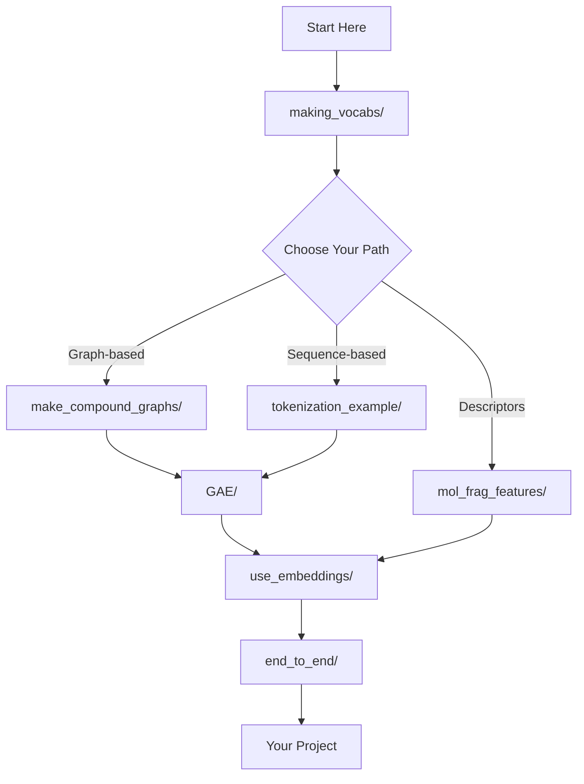

# GSGE Tutorials and Examples

Welcome to the GSGE tutorials! This directory contains comprehensive Jupyter notebooks and Python scripts demonstrating all major functionality of GSGE.

## 📚 Tutorial Overview

These tutorials are designed to help you learn GSGE from basics to advanced usage. Each directory contains detailed examples, code, and explanations.

**Time Categories:**
- **Short** (5-10 min): Quick overviews and examples
- **Medium** (10-30 min): In-depth tutorials with hands-on exercises
- **Long** (30-60+ min): Comprehensive tutorials with training or advanced concepts

*Note: Time estimates vary based on your hardware, prior experience, and whether you use GPU acceleration.*

| Tutorial | Level | Time Category | Time (CPU) | Time (GPU) | Description |
|:---------|:------|:--------------|:----------|:----------|:-------------|
| [**making_vocabs/**](00_making_vocabs/README.md) | Beginner | Medium | 30 min | 30 min | Build custom fragment vocabularies and corpora |
| [**make_compound_graphs/**](01_make_compound_graphs/README.md) | Beginner | Medium | 20 min | 20 min | Create fragment-based graph representations |
| [**tokenization_example/**](02_tokenization_example/README.md) | Beginner | Short | 15 min | 15 min | Tokenize molecules into fragment sequences |
| [**GAE/**](03_GAE/README.md) | Advanced | Long | 4-6 hours | 1-2 hours | Train Graph Autoencoder for embeddings |
| [**use_embeddings/**](04_use_embeddings/README.md) | Intermediate | Medium | 30 min | 30 min | Apply learned embeddings in ML tasks |
| [**mol_frag_features/**](05_mol_frag_features/README.md) | Intermediate | Medium/Long | 45-60 min | 45-60 min | Calculate and use RDKit descriptors |
| [**end_to_end/**](06_end_to_end/README.md) | Intermediate | Long | 5-7 hours | 2-3 hours | Complete end-to-end property prediction pipeline |

## 🚀 Quick Start

### Prerequisites

```bash
# Install GSGE with all dependencies
pip install -e ".[all]"

# Start Jupyter
cd use_examples
jupyter notebook
```

### Recommended Learning Path



## 📖 Tutorial Descriptions

### 1. Building Vocabularies ([`making_vocabs/`](00_making_vocabs/README.md))

**What you'll learn:**
- Extract molecular fragments from datasets
- Create custom vocabularies for your chemical space
- Build corpora for GAE training
- Customize fragment extraction rules
- Save and load vocabularies

**Key outputs:**
- Custom GS_Vocab with merged fragments
- GSGE_Corpus with non-merged fragments
- Pre-built vocabularies for peptides and small molecules

**Notebooks:**
- `vocabulary_and_corpus_tutorial.ipynb` - Complete vocabulary building tutorial

[📘 Full Documentation](00_making_vocabs/README.md)

---

### 2. Creating Compound Graphs ([`make_compound_graphs/`](01_make_compound_graphs/README.md))

**What you'll learn:**
- Convert molecules to fragment-based graphs
- Understand compound graph structure
- Create graphs in PyTorch Geometric format
- Visualize compound graphs
- Use graphs for GNN training

**Key outputs:**
- Compound graphs with fragment nodes
- PyG Data objects for GNNs
- Graph visualizations

**Notebooks:**
- `compound_graphs_tutorial.ipynb` - Compound graph creation and visualization

[📘 Full Documentation](01_make_compound_graphs/README.md)

---

### 3. Tokenization ([`tokenization_example/`](02_tokenization_example/README.md))

**What you'll learn:**
- Tokenize molecules into fragment sequences
- Understand token types (grammar, elements, fragments)
- Create token vocabularies
- Batch processing and padding
- Use tokens with sequence models

**Key outputs:**
- Token sequences for molecules
- Token-to-ID mappings
- Padded sequences for batch processing

**Notebooks:**
- `tokenization_tutorial.ipynb` - Tokenization and sequence processing

[📘 Full Documentation](02_tokenization_example/README.md)

---

### 4. Graph Autoencoder Training ([`GAE/`](03_GAE/README.md))

**What you'll learn:**
- Train AttentiveFP encoder on fragments
- Configure encoder/decoder architectures
- Monitor training metrics
- Generate fragment embeddings
- Analyze learned representations

**Key outputs:**
- Trained GAE model checkpoints
- Fragment embeddings (continuous vectors)
- Training logs and metrics
- Chemical space visualizations

**Files:**
- `train_GAE.py` - Training script
- `gae_training_monitor.ipynb` - Monitor training
- `embedding_visualization.ipynb` - Visualize and analyze embeddings

**Data**: `embedding_visualization.ipynb` uses test_gsge_save_with_descriptors.pkl for pre-computed embeddings (see Pre-trained Assets section)

[📘 Full Documentation](03_GAE/README.md)

---

### 5. Using Fragment Embeddings ([`use_embeddings/`](04_use_embeddings/README.md))

**What you'll learn:**
- Load and use trained embeddings
- Create embedding lookup tables
- Integrate embeddings in GNNs
- Use embeddings for property prediction
- Combine embeddings with descriptors

**Key outputs:**
- Embedding lookup tables for PyTorch
- Molecular features from fragment embeddings
- Property prediction models

**Files:**
- `lookup_table.py` - Example embedding usage

**Data**: Uses test_gsge_save_with_descriptors.pkl for pre-computed embeddings (see Pre-trained Assets section)

[📘 Full Documentation](04_use_embeddings/README.md)

---

### 6. Fragment Descriptors ([`mol_frag_features/`](05_mol_frag_features/README.md))

**What you'll learn:**
- Calculate RDKit descriptors for fragments
- Use 2D and 3D descriptors
- Normalize descriptor values
- Combine descriptors with embeddings
- Feature selection and analysis

**Key outputs:**
- Fragment descriptor matrices
- Combined descriptor+embedding features
- Feature importance analysis

**Notebooks:**
- `molecular_descriptors_2d.ipynb` - 2D descriptors
- `mol_frag_desc_2d3d.ipynb` - 2D and 3D descriptors

**Data**: Uses test_gsge_save_with_descriptors.pkl for pre-computed descriptors (see Pre-trained Assets section)

[📘 Full Documentation](05_mol_frag_features/README.md)

---

### 7. End-to-End Property Prediction ([`end_to_end/`](06_end_to_end/README.md))

**What you'll learn:**
- Build a custom vocabulary for your chemical space
- Train a graph autoencoder to learn fragment embeddings
- Generate embedding features for molecules
- Train a machine learning model for property prediction
- Evaluate model performance and interpret results

**Key outputs:**
- Custom vocabulary and corpus
- Trained GAE model with fragment embeddings
- Property prediction model
- Performance evaluation metrics

**Notebooks:**
- `property_prediction_tutorial.ipynb` - Complete ML pipeline from SMILES to predictions

**Time estimate:** 5-7 hours (CPU) / 2-3 hours (GPU) - GPU strongly recommended for GAE training

[📘 Full Documentation](06_end_to_end/README.md)

---

## 🎯 Use Case Examples

### Property Prediction

```
making_vocabs/ → GAE/ → use_embeddings/ → Your ML Model
```

Build vocabulary, train GAE, use embeddings as features for prediction.

### Molecular Generation

```
making_vocabs/ → tokenization_example/ → Your Generative Model
```

Build vocabulary, tokenize molecules, train sequence generation model.

### Virtual Screening

```
making_vocabs/ → make_compound_graphs/ → use_embeddings/ → Similarity Search
```

Build vocabulary, create graphs, use embeddings for screening.

### Chemical Space Analysis

```
making_vocabs/ → GAE/ → Clustering & Visualization
```

Build vocabulary, train GAE, visualize fragment space with t-SNE/UMAP.

## 💾 Pre-trained Resources

Several tutorials include pre-built resources that you can use to learn GSGE without training models from scratch.

### Available Pre-trained Assets

| Resource | Location | Description |
|:---------|:--------|:-------------|
| **test_gsge_save_with_descriptors.pkl** | `tests/` (project root) | Complete GSGE with embeddings and 48 RDKit descriptors |
| **Peptide Vocabulary** | `making_vocabs/vocabs/` | Vocabulary for cyclic peptides (if built) |
| **Trained GAE Checkpoints** | `GAE/model_checkpoints/` | Pre-trained autoencoder weights (if trained) |

### What's Included in test_gsge_save_with_descriptors.pkl

This pre-trained GSGE instance contains:

- **Trained vocabulary (GS_Vocab)**: Fragment tokens for molecular representation
- **Trained corpus (GSGE_Corpus)**: Fragment data for GAE training
- **Pre-computed fragment embeddings**: 128-dimensional vectors from AttentiveFP encoder
- **Pre-computed fragment descriptors**: 48 RDKit molecular descriptors, normalized
- **Complete GSGE state**: Ready for downstream tasks like clustering and property prediction

**Requirements**: This asset is only available when running from a source checkout (editable install). The tests/ directory is not included in standard pip installs.

### Loading Pre-trained Resources

```python
from GSGE import GSGE, get_tests_dir
from pathlib import Path

# Find the tests directory (requires source checkout)
tests_dir = get_tests_dir()
if tests_dir is None:
    raise RuntimeError(
        "Cannot find tests directory. This notebook requires running from "
        "a source checkout with the tests/ directory available."
    )

# Locate the pre-trained asset
pkl_path = tests_dir / 'test_gsge_save_with_descriptors.pkl'
if not pkl_path.exists():
    raise FileNotFoundError(
        f"Test data file not found: {pkl_path}\n"
        f"Please ensure the tests directory has the required test fixtures."
    )

# Load complete GSGE with embeddings and descriptors
gsge = GSGE(GSGE_load_path=str(pkl_path))

# Ready to use!
cg = gsge.get_CG_from_smiles('CCO', return_CG_object=True)
embeddings = gsge.get_fragment_embeddings()  # Shape: (n_fragments, 128)
descriptors = gsge.get_fragment_descriptors()  # Shape: (n_fragments, 48)
```

### Source Checkout Requirement

The `test_gsge_save_with_descriptors.pkl` file is located in the `tests/` directory at the project root. This directory is only available when:

1. **Cloning the repository**: `git clone https://github.com/CDDLeiden/GSGE.git`
2. **Installing in editable mode**: `pip install -e .`

If you installed GSGE via standard pip install, the tests directory is not available. In that case, you can:
- **Generate your own assets**: Follow the tutorials in `00_making_vocabs/` and `03_GAE/` to train your own vocabulary and embeddings
- **Clone the repository**: Access the pre-trained assets by checking out the source code

### Alternative: Generate Your Own Assets

If you don't have access to the pre-trained assets, you can generate your own:

1. **Build a vocabulary**: See [`00_making_vocabs/vocabulary_and_corpus_tutorial.ipynb`](00_making_vocabs/README.md)
2. **Train embeddings**: See [`03_GAE/train_GAE.py`](03_GAE/README.md)
3. **Calculate descriptors**: See [`05_mol_frag_features/molecular_descriptors_2d.ipynb`](05_mol_frag_features/README.md)

## 🔧 Running the Tutorials

### Option 1: Jupyter Notebook (Recommended)

```bash
cd use_examples
jupyter notebook

# Or for JupyterLab
jupyter lab
```

Navigate to the tutorial folder and open the `.ipynb` file.

### Option 2: Python Scripts

Some tutorials include Python scripts:

```bash
cd use_examples/03_GAE
python train_GAE.py
```

### Option 3: Google Colab

Upload notebooks to Google Colab for free GPU access:

1. Go to [Google Colab](https://colab.research.google.com/)
2. Upload the `.ipynb` file
3. Run on Colab's free GPU

## 📊 Expected Results

| Tutorial | Output | Success Criteria |
|:---------|:-------|:----------------|
| **making_vocabs/** | Vocabulary pickle file | 100-500 fragments, 100% coverage with single elements |
| **make_compound_graphs/** | Compound graphs | 2-40 nodes per molecule depending on size |
| **tokenization_example/** | Token sequences | Valid token IDs matching vocabulary |
| **GAE/** | Trained model checkpoint | Loss < 1.0, checkpoint saved every N epochs |
| **use_embeddings/** | Embedding matrix | Shape: (vocab_size, embedding_dim) |
| **mol_frag_features/** | Descriptor matrix | Shape: (vocab_size, 48 descriptors) |
| **end_to_end/** | Trained predictor model | R² > 0.5 on test set, saved model |

### Detailed Metrics

**Vocabulary Building**
- Vocabulary size: 100-500 fragments (depends on target parameter)
- Processing time: 1-5 minutes for 1000 molecules
- Coverage: 100% with single elements added

**GAE Training**
- Training time (CPU): 4-6 hours for 300 epochs
- Training time (GPU): 1-2 hours for 300 epochs
- Embedding dimension: 64-256
- Reconstruction quality: Loss < 1.0 for well-trained models

**Compound Graphs**
- Small molecule: 2-5 nodes
- Drug-like: 5-15 nodes
- Cyclic peptide: 15-40 nodes
- Creation time: ~0.1s per molecule

## ❗ Common Issues

### Issue: Jupyter kernel dies

**Solution**: Reduce batch sizes, use CPU for small examples

```python
# In notebook
batch_size = 16  # Smaller batch size
device = 'cpu'   # Use CPU instead of GPU
```

### Issue: Missing dependencies

**Solution**: Install optional packages

```bash
pip install plotly seaborn matplotlib ipykernel
```

### Issue: Cannot import GSGE

**Solution**: Install in editable mode

```bash
cd /path/to/GSGE
pip install -e .
```

### Issue: Vocabulary doesn't cover molecules

**Solution**: Add single elements

```python
gsge.add_all_single_elements()
```

## 💡 Common Pitfalls

### 1. Incomplete Vocabulary Coverage

**Problem:** Tokenization fails for some molecules with "fragment not in vocabulary" errors.

**Solution:** Always call `gsge.add_all_single_elements()` after building vocabulary.

```python
# Correct workflow
vocab = GS_Vocab()
vocab.build_vocab(smiles_list, convert=True)
gsge = GSGE(GS_vocab=vocab)
gsge.add_all_single_elements()  # Required for full coverage!
```

### 2. GPU Out of Memory

**Problem:** Training crashes with CUDA out-of-memory error.

**Solution:** Reduce batch size or use CPU.

```python
# Reduce batch size
gsge.train_GSGE_Auto_Encoder(batch_size=16)  # Default is 64

# Or force CPU
device = 'cpu'
gsge.set_device(device)
```

### 3. Device Mismatch

**Problem:** Model on CPU but data on GPU (or vice versa), causing "Expected all tensors to be on the same device" error.

**Solution:** Check device consistency.

```python
import torch

device = 'cuda' if torch.cuda.is_available() else 'cpu'

# Set device for model
gsge.set_encoder()
gsge.load_GAE_weights(checkpoint_path)
gsge.set_device(device)

# Generate embeddings on same device
embeddings = gsge.embed_fragments(frag_smiles, device=device)
```

### 4. Loading Wrong Checkpoint

**Problem:** Model weights don't match architecture, causing shape mismatch errors.

**Solution:** Verify checkpoint architecture matches your model.

```python
# Check checkpoint contents
import torch
checkpoint = torch.load('checkpoint.pth')
print(checkpoint.keys())  # Should have 'encoder', 'decoder', 'optimizer'

# Check encoder architecture
# Must match: in_channels, hidden_channels, out_channels, edge_dim
```

### 5. Token ID Mismatch

**Problem:** Token IDs don't match embedding lookup table indices.

**Solution:** Use the same GSGE instance for tokenization and embedding lookup.

```python
# Correct: Use same gsge instance
tokens = gsge.preprocess_from_SMILES(smiles)
embeddings = gsge.get_fragment_embeddings()  # Same gsge instance

# Wrong: Different instances will have different token mappings
```

### 6. Forgetting to Add Vocabulary to Corpus

**Problem:** GAE training fails because vocabulary fragments aren't in corpus.

**Solution:** Add vocabulary fragments to corpus before training.

```python
# Add vocab fragments to corpus for GAE training
gsge.add_GS_vocab_to_GSGE_corpus(
    gsge.GS_vocab.vocab_fragments,
    gsge.GSGE_corpus
)
```

## 📚 Additional Learning Resources

### Documentation

- [User Guide](../docs/user-guide/index.md) - Comprehensive guides
- [API Reference](../docs/api-reference/index.md) - Complete API docs
- [ARCHITECTURE.md](../ARCHITECTURE.md) - Architecture details

### Research Papers

- AttentiveFP: [Xiong et al., 2020](https://pubs.acs.org/doi/10.1021/acs.jmedchem.9b00959)
- Group-SELFIES: [Cheng et al., 2023](https://doi.org/10.1039/D3DD00012E)
- SELFIES: [Krenn et al., 2020](https://doi.org/10.1088/2632-2153/aba947)

### External Resources

- [PyTorch Geometric](https://pytorch-geometric.readthedocs.io/)
- [RDKit Documentation](https://www.rdkit.org/docs/)
- [Hugging Face Transformers](https://huggingface.co/docs/transformers/)

## 🤝 Contributing

Found an issue with a tutorial? Have suggestions for improvements?

- [Open an issue](https://github.com/CDDLeiden/GSGE/issues)
- [Submit a pull request](https://github.com/CDDLeiden/GSGE/pulls)
- Contact: b.a.a.khalil@lacdr.leidenuniv.nl

## 📝 License

All tutorials are released under the MIT License, same as GSGE.

---

**Happy Learning!** 🚀

For questions or support, please see our [Contributing Guide](../CONTRIBUTING.md) or open an issue on GitHub.
